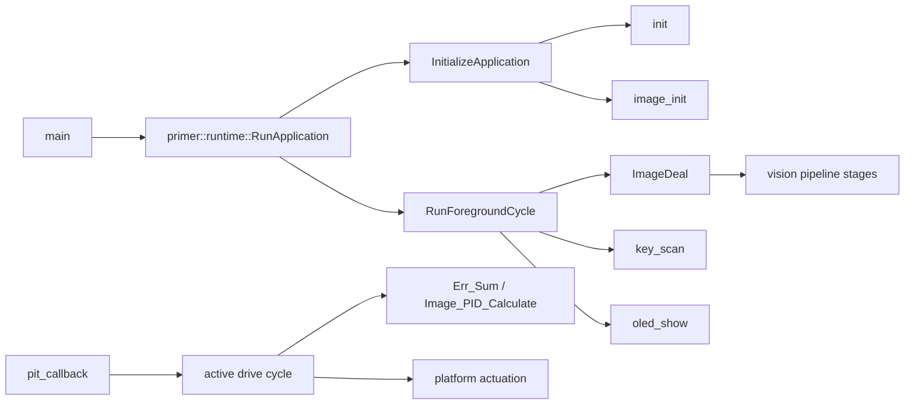

# primer_code 完整函数调用图

- scope：`CMake PRIMER_APP_SRCS + PRIMER_VENDOR_SRCS + active inline headers`。
- 函数定义：**487**；源文件：**63**；唯一调用边：**1068**。
- 调用边分类：internal=475，ambiguous=18，external=575。
- 完整机器可读图：[JSON](function_call_graph_build.json)；完整 Graphviz 图：[DOT](function_call_graph_build.dot)。

## 入口与主链

上图是可读的入口摘要；下方按源文件逐项列出**全部函数定义**。每个函数的完整出边和解析状态以 JSON/DOT 为准。

## 全部函数清单

| 函数 | 所在位置 | 出边调用数 | 入边调用数 |
|---|---|---:|---:|
| `fifo_head_offset` | `primer_code/libraries/zf_common/zf_common_fifo.cpp:44` | 0 | 10 |
| `fifo_end_offset` | `primer_code/libraries/zf_common/zf_common_fifo.cpp:62` | 0 | 2 |
| `fifo_clear` | `primer_code/libraries/zf_common/zf_common_fifo.cpp:79` | 3 | 1 |
| `fifo_used` | `primer_code/libraries/zf_common/zf_common_fifo.cpp:112` | 1 | 4 |
| `fifo_write_element` | `primer_code/libraries/zf_common/zf_common_fifo.cpp:126` | 1 | 0 |
| `fifo_write_buffer` | `primer_code/libraries/zf_common/zf_common_fifo.cpp:170` | 18 | 1 |
| `fifo_read_element` | `primer_code/libraries/zf_common/zf_common_fifo.cpp:285` | 2 | 0 |
| `fifo_read_buffer` | `primer_code/libraries/zf_common/zf_common_fifo.cpp:347` | 11 | 2 |
| `fifo_read_tail_buffer` | `primer_code/libraries/zf_common/zf_common_fifo.cpp:446` | 11 | 0 |
| `fifo_init` | `primer_code/libraries/zf_common/zf_common_fifo.cpp:540` | 0 | 0 |
| `func_get_greatest_common_divisor` | `primer_code/libraries/zf_common/zf_common_function.cpp:44` | 0 | 0 |
| `func_soft_delay` | `primer_code/libraries/zf_common/zf_common_function.cpp:67` | 0 | 0 |
| `func_str_to_int` | `primer_code/libraries/zf_common/zf_common_function.cpp:79` | 0 | 0 |
| `func_int_to_str` | `primer_code/libraries/zf_common/zf_common_function.cpp:123` | 1 | 2 |
| `func_str_to_uint` | `primer_code/libraries/zf_common/zf_common_function.cpp:169` | 0 | 0 |
| `func_uint_to_str` | `primer_code/libraries/zf_common/zf_common_function.cpp:199` | 0 | 2 |
| `func_str_to_float` | `primer_code/libraries/zf_common/zf_common_function.cpp:238` | 0 | 0 |
| `func_float_to_str` | `primer_code/libraries/zf_common/zf_common_function.cpp:299` | 2 | 0 |
| `func_str_to_double` | `primer_code/libraries/zf_common/zf_common_function.cpp:384` | 0 | 0 |
| `func_double_to_str` | `primer_code/libraries/zf_common/zf_common_function.cpp:446` | 2 | 2 |
| `func_str_to_hex` | `primer_code/libraries/zf_common/zf_common_function.cpp:529` | 1 | 0 |
| `func_hex_to_str` | `primer_code/libraries/zf_common/zf_common_function.cpp:587` | 0 | 0 |
| `number_conversion_ascii` | `primer_code/libraries/zf_common/zf_common_function.cpp:636` | 0 | 7 |
| `printf_reverse_order` | `primer_code/libraries/zf_common/zf_common_function.cpp:701` | 0 | 7 |
| `zf_sprintf` | `primer_code/libraries/zf_common/zf_common_function.cpp:722` | 31 | 0 |
| `seekfree_assistant_sum` | `primer_code/libraries/zf_components/seekfree_assistant/seekfree_assistant.cpp:75` | 0 | 2 |
| `seekfree_assistant_camera_data_send` | `primer_code/libraries/zf_components/seekfree_assistant/seekfree_assistant.cpp:97` | 2 | 1 |
| `seekfree_assistant_camera_dot_send` | `primer_code/libraries/zf_components/seekfree_assistant/seekfree_assistant.cpp:149` | 3 | 1 |
| `seekfree_assistant_oscilloscope_send` | `primer_code/libraries/zf_components/seekfree_assistant/seekfree_assistant.cpp:188` | 2 | 0 |
| `seekfree_assistant_camera_information_config` | `primer_code/libraries/zf_components/seekfree_assistant/seekfree_assistant.cpp:226` | 0 | 0 |
| `seekfree_assistant_camera_boundary_config` | `primer_code/libraries/zf_components/seekfree_assistant/seekfree_assistant.cpp:255` | 0 | 0 |
| `seekfree_assistant_camera_send` | `primer_code/libraries/zf_components/seekfree_assistant/seekfree_assistant.cpp:371` | 2 | 0 |
| `seekfree_assistant_data_analysis` | `primer_code/libraries/zf_components/seekfree_assistant/seekfree_assistant.cpp:392` | 6 | 0 |
| `seekfree_assistant_transfer` | `primer_code/libraries/zf_components/seekfree_assistant/seekfree_assistant_interface.cpp:59` | 0 | 0 |
| `seekfree_assistant_receive` | `primer_code/libraries/zf_components/seekfree_assistant/seekfree_assistant_interface.cpp:73` | 0 | 0 |
| `seekfree_assistant_interface_init` | `primer_code/libraries/zf_components/seekfree_assistant/seekfree_assistant_interface.cpp:86` | 0 | 0 |
| `zf_device_dl1x::zf_device_dl1x` | `primer_code/libraries/zf_device/zf_device_dl1x.cpp:43` | 0 | 0 |
| `zf_device_dl1x::~zf_device_dl1x` | `primer_code/libraries/zf_device/zf_device_dl1x.cpp:55` | 1 | 0 |
| `zf_device_dl1x::dl1x_close_all_fd` | `primer_code/libraries/zf_device/zf_device_dl1x.cpp:66` | 1 | 2 |
| `zf_device_dl1x::dl1x_read_fd_data` | `primer_code/libraries/zf_device/zf_device_dl1x.cpp:78` | 3 | 1 |
| `zf_device_dl1x::init` | `primer_code/libraries/zf_device/zf_device_dl1x.cpp:95` | 16 | 0 |
| `zf_device_dl1x::get_dev_type` | `primer_code/libraries/zf_device/zf_device_dl1x.cpp:170` | 0 | 0 |
| `zf_device_dl1x::get_distance` | `primer_code/libraries/zf_device/zf_device_dl1x.cpp:181` | 1 | 0 |
| `zf_device_imu::zf_device_imu` | `primer_code/libraries/zf_device/zf_device_imu.cpp:56` | 0 | 0 |
| `zf_device_imu::~zf_device_imu` | `primer_code/libraries/zf_device/zf_device_imu.cpp:71` | 1 | 0 |
| `zf_device_imu::imu_close_all_fd` | `primer_code/libraries/zf_device/zf_device_imu.cpp:82` | 9 | 3 |
| `zf_device_imu::imu_read_fd_data` | `primer_code/libraries/zf_device/zf_device_imu.cpp:106` | 3 | 9 |
| `zf_device_imu::init` | `primer_code/libraries/zf_device/zf_device_imu.cpp:123` | 27 | 0 |
| `zf_device_imu::get_dev_type` | `primer_code/libraries/zf_device/zf_device_imu.cpp:232` | 0 | 0 |
| `zf_device_imu::get_acc_x` | `primer_code/libraries/zf_device/zf_device_imu.cpp:243` | 1 | 0 |
| `zf_device_imu::get_acc_y` | `primer_code/libraries/zf_device/zf_device_imu.cpp:251` | 1 | 0 |
| `zf_device_imu::get_acc_z` | `primer_code/libraries/zf_device/zf_device_imu.cpp:259` | 1 | 0 |
| `zf_device_imu::get_gyro_x` | `primer_code/libraries/zf_device/zf_device_imu.cpp:267` | 1 | 0 |
| `zf_device_imu::get_gyro_y` | `primer_code/libraries/zf_device/zf_device_imu.cpp:275` | 1 | 0 |
| `zf_device_imu::get_gyro_z` | `primer_code/libraries/zf_device/zf_device_imu.cpp:283` | 1 | 0 |
| `zf_device_imu::get_mag_x` | `primer_code/libraries/zf_device/zf_device_imu.cpp:291` | 1 | 0 |
| `zf_device_imu::get_mag_y` | `primer_code/libraries/zf_device/zf_device_imu.cpp:303` | 1 | 0 |
| `zf_device_imu::get_mag_z` | `primer_code/libraries/zf_device/zf_device_imu.cpp:315` | 1 | 0 |
| `zf_device_ips200::zf_device_ips200` | `primer_code/libraries/zf_device/zf_device_ips200_fb.cpp:45` | 0 | 0 |
| `zf_device_ips200::clear` | `primer_code/libraries/zf_device/zf_device_ips200_fb.cpp:61` | 1 | 0 |
| `zf_device_ips200::full` | `primer_code/libraries/zf_device/zf_device_ips200_fb.cpp:73` | 1 | 1 |
| `zf_device_ips200::draw_point` | `primer_code/libraries/zf_device/zf_device_ips200_fb.cpp:94` | 0 | 16 |
| `zf_device_ips200::draw_line` | `primer_code/libraries/zf_device/zf_device_ips200_fb.cpp:113` | 8 | 0 |
| `zf_device_ips200::show_wave` | `primer_code/libraries/zf_device/zf_device_ips200_fb.cpp:173` | 2 | 0 |
| `zf_device_ips200::show_char` | `primer_code/libraries/zf_device/zf_device_ips200_fb.cpp:203` | 4 | 1 |
| `zf_device_ips200::show_string` | `primer_code/libraries/zf_device/zf_device_ips200_fb.cpp:247` | 1 | 3 |
| `zf_device_ips200::show_int` | `primer_code/libraries/zf_device/zf_device_ips200_fb.cpp:268` | 4 | 0 |
| `zf_device_ips200::show_uint` | `primer_code/libraries/zf_device/zf_device_ips200_fb.cpp:299` | 4 | 0 |
| `zf_device_ips200::show_float` | `primer_code/libraries/zf_device/zf_device_ips200_fb.cpp:330` | 4 | 0 |
| `zf_device_ips200::show_gray_image` | `primer_code/libraries/zf_device/zf_device_ips200_fb.cpp:364` | 1 | 0 |
| `zf_device_ips200::show_rgb565_image` | `primer_code/libraries/zf_device/zf_device_ips200_fb.cpp:411` | 1 | 0 |
| `zf_device_ips200::init` | `primer_code/libraries/zf_device/zf_device_ips200_fb.cpp:435` | 18 | 0 |
| `zf_device_tft180::zf_device_tft180` | `primer_code/libraries/zf_device/zf_device_tft180_fb.cpp:46` | 0 | 0 |
| `zf_device_tft180::clear` | `primer_code/libraries/zf_device/zf_device_tft180_fb.cpp:62` | 1 | 0 |
| `zf_device_tft180::full` | `primer_code/libraries/zf_device/zf_device_tft180_fb.cpp:74` | 1 | 1 |
| `zf_device_tft180::draw_point` | `primer_code/libraries/zf_device/zf_device_tft180_fb.cpp:95` | 0 | 16 |
| `zf_device_tft180::draw_line` | `primer_code/libraries/zf_device/zf_device_tft180_fb.cpp:114` | 8 | 0 |
| `zf_device_tft180::show_wave` | `primer_code/libraries/zf_device/zf_device_tft180_fb.cpp:174` | 2 | 0 |
| `zf_device_tft180::show_char` | `primer_code/libraries/zf_device/zf_device_tft180_fb.cpp:204` | 4 | 1 |
| `zf_device_tft180::show_string` | `primer_code/libraries/zf_device/zf_device_tft180_fb.cpp:248` | 1 | 3 |
| `zf_device_tft180::show_int` | `primer_code/libraries/zf_device/zf_device_tft180_fb.cpp:269` | 4 | 0 |
| `zf_device_tft180::show_uint` | `primer_code/libraries/zf_device/zf_device_tft180_fb.cpp:300` | 4 | 0 |
| `zf_device_tft180::show_float` | `primer_code/libraries/zf_device/zf_device_tft180_fb.cpp:331` | 4 | 0 |
| `zf_device_tft180::show_gray_image` | `primer_code/libraries/zf_device/zf_device_tft180_fb.cpp:364` | 1 | 0 |
| `zf_device_tft180::show_rgb565_image` | `primer_code/libraries/zf_device/zf_device_tft180_fb.cpp:410` | 1 | 0 |
| `zf_device_tft180::init` | `primer_code/libraries/zf_device/zf_device_tft180_fb.cpp:434` | 18 | 0 |
| `zf_device_uvc::zf_device_uvc` | `primer_code/libraries/zf_device/zf_device_uvc.cpp:44` | 0 | 0 |
| `zf_device_uvc::~zf_device_uvc` | `primer_code/libraries/zf_device/zf_device_uvc.cpp:57` | 2 | 0 |
| `zf_device_uvc::wait_image_refresh` | `primer_code/libraries/zf_device/zf_device_uvc.cpp:74` | 3 | 0 |
| `zf_device_uvc::get_gray_image_ptr` | `primer_code/libraries/zf_device/zf_device_uvc.cpp:111` | 2 | 0 |
| `zf_device_uvc::get_rgb_image_ptr` | `primer_code/libraries/zf_device/zf_device_uvc.cpp:126` | 2 | 0 |
| `zf_device_uvc::is_camera_opened` | `primer_code/libraries/zf_device/zf_device_uvc.cpp:141` | 1 | 0 |
| `zf_device_uvc::set_auto_exposure` | `primer_code/libraries/zf_device/zf_device_uvc.cpp:153` | 3 | 1 |
| `zf_device_uvc::set_exposure_value` | `primer_code/libraries/zf_device/zf_device_uvc.cpp:188` | 4 | 0 |
| `zf_device_uvc::get_auto_exposure_mode` | `primer_code/libraries/zf_device/zf_device_uvc.cpp:231` | 3 | 2 |
| `zf_device_uvc::get_current_exposure` | `primer_code/libraries/zf_device/zf_device_uvc.cpp:258` | 3 | 0 |
| `zf_device_uvc::get_frame_mjpg` | `primer_code/libraries/zf_device/zf_device_uvc.cpp:285` | 0 | 0 |
| `zf_device_uvc::init` | `primer_code/libraries/zf_device/zf_device_uvc.cpp:298` | 12 | 0 |
| `zf_driver_adc::zf_driver_adc` | `primer_code/libraries/zf_driver/zf_driver_adc.cpp:19` | 3 | 0 |
| `zf_driver_adc::~zf_driver_adc` | `primer_code/libraries/zf_driver/zf_driver_adc.cpp:41` | 2 | 0 |
| `zf_driver_adc::convert` | `primer_code/libraries/zf_driver/zf_driver_adc.cpp:64` | 4 | 0 |
| `zf_driver_adc::get_scale` | `primer_code/libraries/zf_driver/zf_driver_adc.cpp:87` | 4 | 0 |
| `zf_driver_encoder::zf_driver_encoder` | `primer_code/libraries/zf_driver/zf_driver_encoder.cpp:44` | 0 | 0 |
| `zf_driver_encoder::get_count` | `primer_code/libraries/zf_driver/zf_driver_encoder.cpp:57` | 1 | 1 |
| `zf_driver_encoder::clear_count` | `primer_code/libraries/zf_driver/zf_driver_encoder.cpp:71` | 1 | 1 |
| `zf_driver_file_buffer::zf_driver_file_buffer` | `primer_code/libraries/zf_driver/zf_driver_file_buffer.cpp:48` | 2 | 0 |
| `zf_driver_file_buffer::~zf_driver_file_buffer` | `primer_code/libraries/zf_driver/zf_driver_file_buffer.cpp:71` | 1 | 0 |
| `zf_driver_file_buffer::set_path` | `primer_code/libraries/zf_driver/zf_driver_file_buffer.cpp:88` | 3 | 0 |
| `zf_driver_file_buffer::read_buff` | `primer_code/libraries/zf_driver/zf_driver_file_buffer.cpp:114` | 2 | 0 |
| `zf_driver_file_buffer::write_buff` | `primer_code/libraries/zf_driver/zf_driver_file_buffer.cpp:129` | 2 | 0 |
| `zf_driver_file_string::zf_driver_file_string` | `primer_code/libraries/zf_driver/zf_driver_file_string.cpp:45` | 1 | 0 |
| `zf_driver_file_string::~zf_driver_file_string` | `primer_code/libraries/zf_driver/zf_driver_file_string.cpp:61` | 1 | 0 |
| `zf_driver_file_string::set_path` | `primer_code/libraries/zf_driver/zf_driver_file_string.cpp:78` | 2 | 0 |
| `zf_driver_file_string::read_string` | `primer_code/libraries/zf_driver/zf_driver_file_string.cpp:99` | 1 | 0 |
| `zf_driver_file_string::rewind_file` | `primer_code/libraries/zf_driver/zf_driver_file_string.cpp:117` | 1 | 0 |
| `zf_driver_file_string::write_string` | `primer_code/libraries/zf_driver/zf_driver_file_string.cpp:132` | 1 | 0 |
| `zf_driver_gpio::zf_driver_gpio` | `primer_code/libraries/zf_driver/zf_driver_gpio.cpp:44` | 0 | 0 |
| `zf_driver_gpio::set_level` | `primer_code/libraries/zf_driver/zf_driver_gpio.cpp:57` | 1 | 0 |
| `zf_driver_gpio::get_level` | `primer_code/libraries/zf_driver/zf_driver_gpio.cpp:70` | 1 | 0 |
| `zf_driver_pit::zf_driver_pit` | `primer_code/libraries/zf_driver/zf_driver_pit.cpp:47` | 1 | 0 |
| `zf_driver_pit::~zf_driver_pit` | `primer_code/libraries/zf_driver/zf_driver_pit.cpp:65` | 2 | 0 |
| `zf_driver_pit::set_realtime_priority` | `primer_code/libraries/zf_driver/zf_driver_pit.cpp:78` | 9 | 1 |
| `timerfd_handle_init` | `primer_code/libraries/zf_driver/zf_driver_pit.cpp:108` | 1 | 1 |
| `epollfd_handle_init` | `primer_code/libraries/zf_driver/zf_driver_pit.cpp:121` | 1 | 1 |
| `zf_driver_pit::pit_timer_thread` | `primer_code/libraries/zf_driver/zf_driver_pit.cpp:134` | 6 | 0 |
| `zf_driver_pit::init_ms` | `primer_code/libraries/zf_driver/zf_driver_pit.cpp:177` | 22 | 0 |
| `zf_driver_pit::stop` | `primer_code/libraries/zf_driver/zf_driver_pit.cpp:264` | 4 | 1 |
| `timer_fd::timer_fd` | `primer_code/libraries/zf_driver/zf_driver_pit_fd.cpp:44` | 0 | 0 |
| `timer_fd::~timer_fd` | `primer_code/libraries/zf_driver/zf_driver_pit_fd.cpp:56` | 1 | 0 |
| `timer_fd::start` | `primer_code/libraries/zf_driver/zf_driver_pit_fd.cpp:68` | 1 | 0 |
| `timer_fd::stop` | `primer_code/libraries/zf_driver/zf_driver_pit_fd.cpp:82` | 2 | 1 |
| `timer_fd::init_timer_fd` | `primer_code/libraries/zf_driver/zf_driver_pit_fd.cpp:98` | 5 | 1 |
| `timer_fd::timer_loop` | `primer_code/libraries/zf_driver/zf_driver_pit_fd.cpp:128` | 7 | 0 |
| `zf_driver_pwm::zf_driver_pwm` | `primer_code/libraries/zf_driver/zf_driver_pwm.cpp:44` | 0 | 0 |
| `zf_driver_pwm::get_dev_info` | `primer_code/libraries/zf_driver/zf_driver_pwm.cpp:57` | 1 | 0 |
| `zf_driver_pwm::set_duty` | `primer_code/libraries/zf_driver/zf_driver_pwm.cpp:72` | 1 | 1 |
| `zf_driver_tcp_client::set_nonblocking` | `primer_code/libraries/zf_driver/zf_driver_tcp_client.cpp:46` | 2 | 1 |
| `zf_driver_tcp_client::zf_driver_tcp_client` | `primer_code/libraries/zf_driver/zf_driver_tcp_client.cpp:60` | 2 | 0 |
| `zf_driver_tcp_client::~zf_driver_tcp_client` | `primer_code/libraries/zf_driver/zf_driver_tcp_client.cpp:76` | 1 | 0 |
| `zf_driver_tcp_client::set_retry_param` | `primer_code/libraries/zf_driver/zf_driver_tcp_client.cpp:93` | 0 | 0 |
| `zf_driver_tcp_client::init` | `primer_code/libraries/zf_driver/zf_driver_tcp_client.cpp:107` | 12 | 0 |
| `zf_driver_tcp_client::send_data` | `primer_code/libraries/zf_driver/zf_driver_tcp_client.cpp:154` | 7 | 0 |
| `zf_driver_tcp_client::read_data` | `primer_code/libraries/zf_driver/zf_driver_tcp_client.cpp:220` | 2 | 0 |
| `zf_driver_udp::zf_driver_udp` | `primer_code/libraries/zf_driver/zf_driver_udp.cpp:43` | 1 | 0 |
| `zf_driver_udp::~zf_driver_udp` | `primer_code/libraries/zf_driver/zf_driver_udp.cpp:57` | 1 | 0 |
| `zf_driver_udp::init` | `primer_code/libraries/zf_driver/zf_driver_udp.cpp:74` | 5 | 0 |
| `zf_driver_udp::send_data` | `primer_code/libraries/zf_driver/zf_driver_udp.cpp:101` | 2 | 0 |
| `zf_driver_udp::read_data` | `primer_code/libraries/zf_driver/zf_driver_udp.cpp:121` | 2 | 0 |
| `primer::control::ImageController` | `primer_code/project/code/control/pid_controller.cpp:7` | 0 | 1 |
| `primer::control::DistanceController` | `primer_code/project/code/control/pid_controller.cpp:8` | 0 | 0 |
| `primer::control::LeftVelocityController` | `primer_code/project/code/control/pid_controller.cpp:9` | 0 | 0 |
| `primer::control::RightVelocityController` | `primer_code/project/code/control/pid_controller.cpp:10` | 0 | 0 |
| `primer::control::MasterSpeed` | `primer_code/project/code/control/pid_controller.cpp:11` | 0 | 1 |
| `primer::control::ImageOutput` | `primer_code/project/code/control/pid_controller.cpp:12` | 0 | 0 |
| `primer::control::MutableImageOutput` | `primer_code/project/code/control/pid_controller.cpp:13` | 0 | 1 |
| `primer::control::CurrentSpeed` | `primer_code/project/code/control/pid_controller.cpp:14` | 0 | 1 |
| `primer::control::DistanceOutput` | `primer_code/project/code/control/pid_controller.cpp:15` | 0 | 0 |
| `primer::control::AccessRuntimeControlState` | `primer_code/project/code/control/pid_controller.cpp:16` | 0 | 35 |
| `primer::control::AccessEncoderControlState` | `primer_code/project/code/control/pid_controller.cpp:22` | 0 | 0 |
| `PID_Init` | `primer_code/project/code/control/pid_controller.cpp:38` | 0 | 1 |
| `Speed_PID_Init` | `primer_code/project/code/control/pid_controller.cpp:52` | 0 | 3 |
| `Pos_Cal` | `primer_code/project/code/control/pid_controller.cpp:64` | 0 | 0 |
| `Inc_Cal` | `primer_code/project/code/control/pid_controller.cpp:90` | 2 | 0 |
| `Speed_PID_Cal` | `primer_code/project/code/control/pid_controller.cpp:124` | 4 | 2 |
| `Image_PID_Calculate` | `primer_code/project/code/control/pid_controller.cpp:142` | 2 | 0 |
| `Dis_PID_CalculateCore` | `primer_code/project/code/control/pid_controller.cpp:154` | 0 | 1 |
| `speed_difference_Calculate` | `primer_code/project/code/control/pid_controller.cpp:182` | 1 | 0 |
| `Direction_PID_Init` | `primer_code/project/code/control/pid_controller.cpp:205` | 4 | 1 |
| `LPF_1` | `primer_code/project/code/estimation/imu_estimator.cpp:130` | 1 | 5 |
| `primer::estimation::AccessRawImuState` | `primer_code/project/code/estimation/imu_estimator.cpp:165` | 0 | 0 |
| `primer::estimation::CurrentImuEstimate` | `primer_code/project/code/estimation/imu_estimator.cpp:171` | 0 | 2 |
| `primer::estimation::SetRawGyroscope` | `primer_code/project/code/estimation/imu_estimator.cpp:176` | 0 | 0 |
| `fast_sqrt` | `primer_code/project/code/estimation/imu_estimator.cpp:185` | 2 | 2 |
| `GyroOffset_InitCore` | `primer_code/project/code/estimation/imu_estimator.cpp:212` | 3 | 1 |
| `ICM_getValues` | `primer_code/project/code/estimation/imu_estimator.cpp:244` | 0 | 1 |
| `ICM_AHRSupdate` | `primer_code/project/code/estimation/imu_estimator.cpp:266` | 2 | 1 |
| `ICM_GetEulerianAnglesCore` | `primer_code/project/code/estimation/imu_estimator.cpp:331` | 7 | 1 |
| `HuandaoYawCorrectCore` | `primer_code/project/code/estimation/imu_estimator.cpp:352` | 0 | 1 |
| `LQ_NCNN::LQ_NCNN` | `primer_code/project/code/inference/lq_ncnn.cpp:16` | 0 | 0 |
| `LQ_NCNN::Init` | `primer_code/project/code/inference/lq_ncnn.cpp:40` | 12 | 1 |
| `LQ_NCNN::Infer` | `primer_code/project/code/inference/lq_ncnn.cpp:113` | 16 | 1 |
| `LQ_NCNN::SetModelPath` | `primer_code/project/code/inference/lq_ncnn.cpp:165` | 0 | 1 |
| `LQ_NCNN::SetInputSize` | `primer_code/project/code/inference/lq_ncnn.cpp:180` | 0 | 1 |
| `LQ_NCNN::SetLabels` | `primer_code/project/code/inference/lq_ncnn.cpp:194` | 0 | 1 |
| `LQ_NCNN::SetNormalize` | `primer_code/project/code/inference/lq_ncnn.cpp:208` | 0 | 1 |
| `LQ_NCNN::Argmax` | `primer_code/project/code/inference/lq_ncnn.cpp:245` | 2 | 1 |
| `LQ_NCNN::~LQ_NCNN` | `primer_code/project/code/inference/lq_ncnn.cpp:294` | 0 | 0 |
| `primer::parameters::CurrentParameters` | `primer_code/project/code/parameters/parameter_store.cpp:28` | 0 | 1 |
| `primer::parameters::MutableParameters` | `primer_code/project/code/parameters/parameter_store.cpp:33` | 0 | 1 |
| `parse_line` | `primer_code/project/code/parameters/parameter_store.cpp:50` | 2 | 10 |
| `Param_Init` | `primer_code/project/code/parameters/parameter_store.cpp:82` | 16 | 1 |
| `Param_SaveSingle` | `primer_code/project/code/parameters/parameter_store.cpp:157` | 13 | 0 |
| `Param_SaveAll` | `primer_code/project/code/parameters/parameter_store.cpp:205` | 4 | 2 |
| `primer::platform::LeftEncoder` | `primer_code/project/code/platform/device_platform.cpp:5` | 0 | 5 |
| `primer::platform::RightEncoder` | `primer_code/project/code/platform/device_platform.cpp:6` | 0 | 5 |
| `primer::platform::Imu` | `primer_code/project/code/platform/device_platform.cpp:7` | 0 | 0 |
| `primer::platform::Display` | `primer_code/project/code/platform/device_platform.cpp:8` | 0 | 3 |
| `primer::platform::DigitalKey` | `primer_code/project/code/platform/device_platform.cpp:9` | 0 | 1 |
| `primer::platform::AnalogKey` | `primer_code/project/code/platform/device_platform.cpp:14` | 0 | 1 |
| `primer::platform::SetBeeper` | `primer_code/project/code/platform/device_platform.cpp:19` | 1 | 2 |
| `primer::platform::SetEscDuty` | `primer_code/project/code/platform/device_platform.cpp:20` | 1 | 3 |
| `primer::platform::SetMotorDriverDuty` | `primer_code/project/code/platform/device_platform.cpp:21` | 1 | 0 |
| `primer::platform::CaptureMotorDriverInfo` | `primer_code/project/code/platform/device_platform.cpp:25` | 2 | 0 |
| `primer::platform::StopPeriodicTimer` | `primer_code/project/code/platform/device_platform.cpp:30` | 1 | 0 |
| `primer::platform::InitializeImu` | `primer_code/project/code/platform/device_platform.cpp:31` | 1 | 0 |
| `primer::platform::CaptureEscInfo` | `primer_code/project/code/platform/device_platform.cpp:32` | 1 | 0 |
| `primer::platform::InitializeDistanceSensor` | `primer_code/project/code/platform/device_platform.cpp:33` | 1 | 0 |
| `primer::platform::InitializeDisplay` | `primer_code/project/code/platform/device_platform.cpp:34` | 1 | 0 |
| `primer::platform::ReadEncoderCount` | `primer_code/project/code/platform/device_platform.cpp:35` | 2 | 0 |
| `primer::platform::ClearEncoderCount` | `primer_code/project/code/platform/device_platform.cpp:39` | 1 | 0 |
| `primer::platform::ReadDistanceSensor` | `primer_code/project/code/platform/device_platform.cpp:43` | 1 | 1 |
| `primer::platform::StartPeriodicTimer` | `primer_code/project/code/platform/device_platform.cpp:44` | 1 | 1 |
| `primer::platform::DistanceRaw` | `primer_code/project/code/platform/device_platform.cpp:48` | 0 | 1 |
| `primer::platform::DistanceRawSignal` | `primer_code/project/code/platform/device_platform.cpp:49` | 0 | 1 |
| `primer::platform::MutableDistanceRawSignal` | `primer_code/project/code/platform/device_platform.cpp:50` | 0 | 2 |
| `set_pwm` | `primer_code/project/code/platform/device_platform.cpp:54` | 8 | 2 |
| `primer::port::ApplyLowPass` | `primer_code/project/code/port/low_pass_filter.hpp:6` | 0 | 2 |
| `SampleOperatorInputs` | `primer_code/project/code/presentation/input/key_input.cpp:7` | 16 | 1 |
| `ApplyNavigationInputs` | `primer_code/project/code/presentation/input/key_input.cpp:19` | 4 | 1 |
| `ApplyRunCommandInputs` | `primer_code/project/code/presentation/input/key_input.cpp:41` | 7 | 1 |
| `ApplyParameterAdjustmentInputs` | `primer_code/project/code/presentation/input/key_input.cpp:57` | 8 | 1 |
| `LatchOperatorInputs` | `primer_code/project/code/presentation/input/key_input.cpp:75` | 0 | 1 |
| `presentation_scan_input` | `primer_code/project/code/presentation/input/key_input.cpp:89` | 5 | 1 |
| `primer::presentation::internal::RenderTrackedBinaryImage` | `primer_code/project/code/presentation/internal/page_common.hpp:11` | 8 | 2 |
| `primer::presentation::internal::RenderPageFooter` | `primer_code/project/code/presentation/internal/page_common.hpp:41` | 6 | 5 |
| `presentation_render_oled_pages` | `primer_code/project/code/presentation/pages/oled_pages.cpp:3` | 5 | 1 |
| `primer::presentation::RenderPage0Status` | `primer_code/project/code/presentation/pages/page0.cpp:12` | 24 | 1 |
| `primer::presentation::RenderPage0BoundaryStatus` | `primer_code/project/code/presentation/pages/page0.cpp:28` | 32 | 1 |
| `primer::presentation::RenderPage0TrackingStatus` | `primer_code/project/code/presentation/pages/page0.cpp:48` | 38 | 1 |
| `primer::presentation::RenderPage0CornerCoordinates` | `primer_code/project/code/presentation/pages/page0.cpp:68` | 16 | 1 |
| `primer::presentation::RenderPage0` | `primer_code/project/code/presentation/pages/page0.cpp:82` | 6 | 1 |
| `primer::presentation::RenderPage1DetectionStatus` | `primer_code/project/code/presentation/pages/page1.cpp:12` | 24 | 1 |
| `primer::presentation::RenderPage1BoundaryStatus` | `primer_code/project/code/presentation/pages/page1.cpp:28` | 32 | 1 |
| `primer::presentation::RenderPage1TrackingStatus` | `primer_code/project/code/presentation/pages/page1.cpp:48` | 34 | 1 |
| `primer::presentation::RenderPage1CornerCoordinates` | `primer_code/project/code/presentation/pages/page1.cpp:68` | 16 | 1 |
| `primer::presentation::RenderPage1` | `primer_code/project/code/presentation/pages/page1.cpp:82` | 6 | 1 |
| `primer::presentation::RenderPage2` | `primer_code/project/code/presentation/pages/page2.cpp:11` | 55 | 1 |
| `primer::presentation::RenderPage3` | `primer_code/project/code/presentation/pages/page3.cpp:10` | 1 | 1 |
| `primer::presentation::RenderRedDebugPage` | `primer_code/project/code/presentation/pages/red_debug_page.cpp:13` | 51 | 1 |
| `key_scan` | `primer_code/project/code/presentation/show.cpp:3` | 1 | 1 |
| `oled_show` | `primer_code/project/code/presentation/show.cpp:8` | 1 | 1 |
| `SamplePeriodicInputs` | `primer_code/project/code/runtime/application.cpp:37` | 6 | 1 |
| `ConfigureActiveDriveGoal` | `primer_code/project/code/runtime/application.cpp:46` | 9 | 1 |
| `UpdateActiveDistanceOutput` | `primer_code/project/code/runtime/application.cpp:61` | 5 | 1 |
| `UpdateActiveVelocityTargets` | `primer_code/project/code/runtime/application.cpp:66` | 14 | 1 |
| `UpdateActiveWheelPwm` | `primer_code/project/code/runtime/application.cpp:82` | 18 | 1 |
| `ApplyActiveWheelPwm` | `primer_code/project/code/runtime/application.cpp:88` | 3 | 1 |
| `ApplyActiveDriveCycle` | `primer_code/project/code/runtime/application.cpp:93` | 6 | 1 |
| `ApplyStoppedDriveCycle` | `primer_code/project/code/runtime/application.cpp:105` | 4 | 1 |
| `CompletePeriodicCycle` | `primer_code/project/code/runtime/application.cpp:115` | 18 | 1 |
| `InitializeApplication` | `primer_code/project/code/runtime/application.cpp:127` | 5 | 1 |
| `UpdateForegroundBeeper` | `primer_code/project/code/runtime/application.cpp:140` | 7 | 1 |
| `UpdateForegroundFrameTiming` | `primer_code/project/code/runtime/application.cpp:148` | 6 | 1 |
| `RunForegroundPresentation` | `primer_code/project/code/runtime/application.cpp:173` | 4 | 1 |
| `RunForegroundCycle` | `primer_code/project/code/runtime/application.cpp:182` | 4 | 1 |
| `pit_callback` | `primer_code/project/code/runtime/application.cpp:192` | 4 | 0 |
| `primer::runtime::RunApplication` | `primer_code/project/code/runtime/application.cpp:203` | 2 | 1 |
| `Dis_PID_Calculate` | `primer_code/project/code/runtime/control_adapter.cpp:4` | 1 | 1 |
| `DelayMilliseconds` | `primer_code/project/code/runtime/estimation_adapter.cpp:9` | 1 | 0 |
| `imu660ra_get_acc` | `primer_code/project/code/runtime/estimation_adapter.cpp:15` | 3 | 0 |
| `imu660ra_get_gyro` | `primer_code/project/code/runtime/estimation_adapter.cpp:26` | 3 | 0 |
| `gyroOffset_init` | `primer_code/project/code/runtime/estimation_adapter.cpp:37` | 1 | 1 |
| `ICM_getEulerianAngles` | `primer_code/project/code/runtime/estimation_adapter.cpp:43` | 1 | 1 |
| `huandao_yaw_correct` | `primer_code/project/code/runtime/estimation_adapter.cpp:48` | 1 | 1 |
| `primer::port::CorrectRoundaboutYaw` | `primer_code/project/code/runtime/estimation_adapter.cpp:54` | 1 | 2 |
| `primer::port::CurrentYaw` | `primer_code/project/code/runtime/estimation_adapter.cpp:59` | 0 | 2 |
| `primer::runtime::RunFlag` | `primer_code/project/code/runtime/hardware_composition.cpp:62` | 0 | 5 |
| `primer::runtime::SetRunFlag` | `primer_code/project/code/runtime/hardware_composition.cpp:63` | 0 | 1 |
| `primer::runtime::CycleCounter` | `primer_code/project/code/runtime/hardware_composition.cpp:64` | 0 | 3 |
| `primer::runtime::SpeedFusionWeight` | `primer_code/project/code/runtime/hardware_composition.cpp:65` | 0 | 0 |
| `primer::runtime::LeftEncoderTotal` | `primer_code/project/code/runtime/hardware_composition.cpp:66` | 0 | 0 |
| `primer::runtime::RightEncoderTotal` | `primer_code/project/code/runtime/hardware_composition.cpp:67` | 0 | 0 |
| `primer::runtime::EncoderDistance` | `primer_code/project/code/runtime/hardware_composition.cpp:68` | 0 | 0 |
| `primer::runtime::ObserveRuntimeTelemetry` | `primer_code/project/code/runtime/hardware_composition.cpp:69` | 0 | 1 |
| `primer::runtime::AccessRuntimeCounters` | `primer_code/project/code/runtime/hardware_composition.cpp:73` | 0 | 0 |
| `primer::port::SetRunMode` | `primer_code/project/code/runtime/hardware_composition.cpp:80` | 0 | 1 |
| `pid_init` | `primer_code/project/code/runtime/lifecycle.cpp:11` | 1 | 1 |
| `sigint_handler` | `primer_code/project/code/runtime/lifecycle.cpp:20` | 4 | 0 |
| `cleanup` | `primer_code/project/code/runtime/lifecycle.cpp:28` | 6 | 0 |
| `init` | `primer_code/project/code/runtime/lifecycle.cpp:40` | 9 | 1 |
| `Encoder_update` | `primer_code/project/code/runtime/lifecycle.cpp:55` | 11 | 1 |
| `primer::port::presentation::ReadDigitalKey` | `primer_code/project/code/runtime/presentation_ports.cpp:12` | 2 | 1 |
| `primer::port::presentation::ReadAnalogKey` | `primer_code/project/code/runtime/presentation_ports.cpp:17` | 2 | 1 |
| `primer::port::presentation::ClearDisplay` | `primer_code/project/code/runtime/presentation_ports.cpp:22` | 2 | 1 |
| `primer::port::presentation::ShowGrayImage` | `primer_code/project/code/runtime/presentation_ports.cpp:27` | 2 | 1 |
| `primer::port::presentation::ShowString` | `primer_code/project/code/runtime/presentation_ports.cpp:35` | 2 | 1 |
| `DigitalKey::get_level` | `primer_code/project/code/runtime/presentation_ports.cpp:42` | 1 | 1 |
| `AnalogKey::convert` | `primer_code/project/code/runtime/presentation_ports.cpp:47` | 1 | 1 |
| `Display::clear` | `primer_code/project/code/runtime/presentation_ports.cpp:52` | 1 | 1 |
| `Display::show_gray_image` | `primer_code/project/code/runtime/presentation_ports.cpp:57` | 1 | 1 |
| `Display::show_string` | `primer_code/project/code/runtime/presentation_ports.cpp:66` | 1 | 1 |
| `primer::port::presentation::SetEscDuty` | `primer_code/project/code/runtime/presentation_ports.cpp:71` | 1 | 1 |
| `primer::port::presentation::RunFlag` | `primer_code/project/code/runtime/presentation_ports.cpp:76` | 1 | 0 |
| `primer::port::presentation::SetRunFlag` | `primer_code/project/code/runtime/presentation_ports.cpp:81` | 1 | 2 |
| `primer::port::presentation::SaveParameters` | `primer_code/project/code/runtime/presentation_ports.cpp:86` | 1 | 2 |
| `primer::port::presentation::ObserveParameters` | `primer_code/project/code/runtime/presentation_ports.cpp:91` | 1 | 12 |
| `primer::port::presentation::ObserveImu` | `primer_code/project/code/runtime/presentation_ports.cpp:98` | 1 | 3 |
| `primer::port::presentation::ObserveDistanceRaw` | `primer_code/project/code/runtime/presentation_ports.cpp:104` | 1 | 1 |
| `primer::port::presentation::ObserveTelemetry` | `primer_code/project/code/runtime/presentation_ports.cpp:109` | 1 | 3 |
| `primer::port::presentation::DistanceToRow` | `primer_code/project/code/runtime/presentation_ports.cpp:116` | 1 | 2 |
| `primer::inference::Classifier` | `primer_code/project/code/runtime/service_composition.cpp:11` | 0 | 0 |
| `primer::transport::CameraStreamServer` | `primer_code/project/code/runtime/service_composition.cpp:15` | 0 | 0 |
| `primer::platform::Camera` | `primer_code/project/code/runtime/service_composition.cpp:19` | 0 | 0 |
| `primer::platform::StopCamera` | `primer_code/project/code/runtime/service_composition.cpp:20` | 1 | 0 |
| `primer::port::DirectionControllerAdapter` | `primer_code/project/code/runtime/vision_stage_ports.cpp:80` | 0 | 0 |
| `primer::port::VisionClassifier` | `primer_code/project/code/runtime/vision_stage_ports.cpp:94` | 0 | 6 |
| `primer::port::VisionCamera` | `primer_code/project/code/runtime/vision_stage_ports.cpp:100` | 0 | 7 |
| `primer::port::VisionStream` | `primer_code/project/code/runtime/vision_stage_ports.cpp:106` | 0 | 1 |
| `primer::port::VisionParameters` | `primer_code/project/code/runtime/vision_stage_ports.cpp:112` | 1 | 3 |
| `primer::port::VisionDirectionController` | `primer_code/project/code/runtime/vision_stage_ports.cpp:123` | 1 | 6 |
| `primer::port::CalculateVisionDirection` | `primer_code/project/code/runtime/vision_stage_ports.cpp:129` | 1 | 1 |
| `primer::port::MutableVisionImageOutput` | `primer_code/project/code/runtime/vision_stage_ports.cpp:135` | 1 | 1 |
| `primer::port::VisionMasterSpeed` | `primer_code/project/code/runtime/vision_stage_ports.cpp:136` | 1 | 5 |
| `primer::port::VisionCurrentSpeed` | `primer_code/project/code/runtime/vision_stage_ports.cpp:137` | 1 | 1 |
| `primer::port::VisionLeftEncoder` | `primer_code/project/code/runtime/vision_stage_ports.cpp:139` | 1 | 2 |
| `primer::port::VisionRightEncoder` | `primer_code/project/code/runtime/vision_stage_ports.cpp:145` | 1 | 2 |
| `primer::port::SetVisionEscDuty` | `primer_code/project/code/runtime/vision_stage_ports.cpp:151` | 1 | 1 |
| `primer::port::SetVisionRunMode` | `primer_code/project/code/runtime/vision_stage_ports.cpp:152` | 1 | 1 |
| `primer::port::VisionDistanceRaw` | `primer_code/project/code/runtime/vision_stage_ports.cpp:153` | 1 | 2 |
| `TransmissionStreamServer::TransmissionStreamServer` | `primer_code/project/code/transport/ww_transmission.cpp:183` | 3 | 0 |
| `TransmissionStreamServer::~TransmissionStreamServer` | `primer_code/project/code/transport/ww_transmission.cpp:197` | 4 | 0 |
| `TransmissionStreamServer::get_local_ip` | `primer_code/project/code/transport/ww_transmission.cpp:213` | 13 | 0 |
| `TransmissionStreamServer::close_server_socket` | `primer_code/project/code/transport/ww_transmission.cpp:294` | 4 | 1 |
| `TransmissionStreamServer::now_ms` | `primer_code/project/code/transport/ww_transmission.cpp:310` | 3 | 3 |
| `TransmissionStreamServer::format_timestamp` | `primer_code/project/code/transport/ww_transmission.cpp:324` | 4 | 0 |
| `TransmissionStreamServer::send_response` | `primer_code/project/code/transport/ww_transmission.cpp:346` | 5 | 4 |
| `TransmissionStreamServer::send_stats_response` | `primer_code/project/code/transport/ww_transmission.cpp:363` | 8 | 1 |
| `TransmissionStreamServer::send_mjpeg_stream` | `primer_code/project/code/transport/ww_transmission.cpp:388` | 17 | 1 |
| `TransmissionStreamServer::handle_snapshot_request` | `primer_code/project/code/transport/ww_transmission.cpp:443` | 18 | 1 |
| `TransmissionStreamServer::handle_client_request` | `primer_code/project/code/transport/ww_transmission.cpp:488` | 27 | 0 |
| `TransmissionStreamServer::client_thread_func` | `primer_code/project/code/transport/ww_transmission.cpp:574` | 2 | 0 |
| `TransmissionStreamServer::server_thread_func` | `primer_code/project/code/transport/ww_transmission.cpp:599` | 17 | 0 |
| `TransmissionStreamServer::start_server` | `primer_code/project/code/transport/ww_transmission.cpp:695` | 3 | 1 |
| `TransmissionStreamServer::update_frame_mat` | `primer_code/project/code/transport/ww_transmission.cpp:728` | 9 | 0 |
| `TransmissionStreamServer::update_frame_jpeg` | `primer_code/project/code/transport/ww_transmission.cpp:782` | 8 | 0 |
| `TransmissionStreamServer::stop_server` | `primer_code/project/code/transport/ww_transmission.cpp:831` | 2 | 1 |
| `TransmissionStreamServer::is_running` | `primer_code/project/code/transport/ww_transmission.cpp:854` | 0 | 0 |
| `Yaw_correct` | `primer_code/project/code/vision/facts.cpp:54` | 0 | 0 |
| `actan_err` | `primer_code/project/code/vision/facts.cpp:77` | 0 | 0 |
| `real_distance_to_row` | `primer_code/project/code/vision/facts.cpp:124` | 1 | 19 |
| `primer::vision::ObserveVisionControlLiveView` | `primer_code/project/code/vision/facts.cpp:141` | 0 | 20 |
| `primer::vision::AccessRoundaboutYawState` | `primer_code/project/code/vision/facts.cpp:147` | 0 | 0 |
| `primer::vision::VisionDynamicForward` | `primer_code/project/code/vision/facts.cpp:152` | 0 | 0 |
| `primer::vision::SetVisionDynamicForward` | `primer_code/project/code/vision/facts.cpp:157` | 0 | 2 |
| `primer::vision::VisionRoundaboutYaw` | `primer_code/project/code/vision/facts.cpp:162` | 0 | 0 |
| `primer::vision::SetVisionRoundaboutYawCorrection` | `primer_code/project/code/vision/facts.cpp:167` | 0 | 0 |
| `primer::port::vision::ObserveBinaryImage` | `primer_code/project/code/vision/facts.cpp:177` | 0 | 2 |
| `primer::port::vision::ObserveLeftSideline` | `primer_code/project/code/vision/facts.cpp:178` | 0 | 3 |
| `primer::port::vision::ObserveRightSideline` | `primer_code/project/code/vision/facts.cpp:179` | 0 | 3 |
| `primer::port::vision::ObserveMidline` | `primer_code/project/code/vision/facts.cpp:180` | 0 | 2 |
| `primer::port::vision::ObserveElementFacts` | `primer_code/project/code/vision/facts.cpp:181` | 0 | 11 |
| `primer::port::vision::ObserveImageInformation` | `primer_code/project/code/vision/facts.cpp:182` | 0 | 6 |
| `primer::port::vision::ObserveLeftLowCorner` | `primer_code/project/code/vision/facts.cpp:183` | 0 | 2 |
| `primer::port::vision::ObserveLeftHighCorner` | `primer_code/project/code/vision/facts.cpp:184` | 0 | 10 |
| `primer::port::vision::ObserveRightLowCorner` | `primer_code/project/code/vision/facts.cpp:185` | 0 | 2 |
| `primer::port::vision::ObserveRightHighCorner` | `primer_code/project/code/vision/facts.cpp:186` | 0 | 10 |
| `primer::port::vision::ObserveLeftHighCornerSecondary` | `primer_code/project/code/vision/facts.cpp:187` | 0 | 4 |
| `primer::port::vision::ObserveRightHighCornerSecondary` | `primer_code/project/code/vision/facts.cpp:188` | 0 | 3 |
| `primer::port::vision::ObserveRowDistance` | `primer_code/project/code/vision/facts.cpp:189` | 0 | 3 |
| `primer::port::vision::ObserveResizedFrame` | `primer_code/project/code/vision/facts.cpp:190` | 0 | 5 |
| `primer::port::vision::ObserveDirectionError` | `primer_code/project/code/vision/facts.cpp:191` | 0 | 3 |
| `primer::port::vision::ObserveDistance` | `primer_code/project/code/vision/facts.cpp:192` | 0 | 3 |
| `primer::port::vision::ObserveRoundaboutYawError` | `primer_code/project/code/vision/facts.cpp:193` | 0 | 1 |
| `primer::port::vision::ObserveBlackRatio` | `primer_code/project/code/vision/facts.cpp:194` | 0 | 1 |
| `primer::port::vision::ObserveJumpPoint` | `primer_code/project/code/vision/facts.cpp:195` | 0 | 2 |
| `primer::port::vision::ObserveMaxlongColumn` | `primer_code/project/code/vision/facts.cpp:196` | 0 | 1 |
| `primer::port::vision::ObserveLongMax` | `primer_code/project/code/vision/facts.cpp:197` | 0 | 1 |
| `primer::port::vision::ObserveJumpPointSecondary` | `primer_code/project/code/vision/facts.cpp:198` | 0 | 1 |
| `primer::port::vision::ObservePictureWhite` | `primer_code/project/code/vision/facts.cpp:199` | 0 | 1 |
| `primer::port::vision::ObservePictureBlack` | `primer_code/project/code/vision/facts.cpp:200` | 0 | 1 |
| `primer::port::vision::ObserveRedFindX` | `primer_code/project/code/vision/facts.cpp:201` | 0 | 1 |
| `primer::port::vision::ObserveRedFindY` | `primer_code/project/code/vision/facts.cpp:202` | 0 | 1 |
| `imgInfoInit` | `primer_code/project/code/vision/facts.cpp:206` | 0 | 1 |
| `debug_log_printf_callback` | `primer_code/project/code/vision/facts.cpp:215` | 1 | 0 |
| `zf_model_init` | `primer_code/project/code/vision/facts.cpp:221` | 29 | 0 |
| `RepairFourCorners` | `primer_code/project/code/vision/line_repair.cpp:7` | 5 | 1 |
| `RepairLeftPairAndRightHigh` | `primer_code/project/code/vision/line_repair.cpp:37` | 5 | 1 |
| `RepairRightPairAndLeftHigh` | `primer_code/project/code/vision/line_repair.cpp:71` | 5 | 1 |
| `RepairBothHighCorners` | `primer_code/project/code/vision/line_repair.cpp:105` | 5 | 1 |
| `RepairLeftCornerPair` | `primer_code/project/code/vision/line_repair.cpp:134` | 2 | 1 |
| `RepairRightCornerPair` | `primer_code/project/code/vision/line_repair.cpp:155` | 2 | 1 |
| `RepairLeftHighCorner` | `primer_code/project/code/vision/line_repair.cpp:176` | 2 | 1 |
| `RepairRightHighCorner` | `primer_code/project/code/vision/line_repair.cpp:196` | 2 | 1 |
| `Buxian` | `primer_code/project/code/vision/line_repair.cpp:218` | 8 | 1 |
| `ResizeAndConvertFrame` | `primer_code/project/code/vision/pipeline.cpp:6` | 3 | 1 |
| `CopyGrayFrameToImageUse` | `primer_code/project/code/vision/pipeline.cpp:12` | 0 | 1 |
| `BinarizeFrame` | `primer_code/project/code/vision/pipeline.cpp:25` | 1 | 1 |
| `ExtractTrackFacts` | `primer_code/project/code/vision/pipeline.cpp:30` | 7 | 1 |
| `DetectScenes` | `primer_code/project/code/vision/pipeline.cpp:49` | 6 | 1 |
| `RepairTrackLines` | `primer_code/project/code/vision/pipeline.cpp:68` | 1 | 1 |
| `CompleteVisionPipeline` | `primer_code/project/code/vision/pipeline.cpp:77` | 3 | 1 |
| `ImageDeal` | `primer_code/project/code/vision/pipeline.cpp:86` | 10 | 1 |
| `image_init` | `primer_code/project/code/vision/pipeline_init.cpp:5` | 33 | 1 |
| `Threshold_deal` | `primer_code/project/code/vision/preprocess.cpp:3` | 3 | 2 |
| `Get01change_dajin` | `primer_code/project/code/vision/preprocess.cpp:65` | 1 | 1 |
| `my_sobel` | `primer_code/project/code/vision/preprocess.cpp:123` | 2 | 0 |
| `my_sobel_dajin` | `primer_code/project/code/vision/preprocess.cpp:175` | 3 | 0 |
| `Draw_BlackSideline` | `primer_code/project/code/vision/preprocess.cpp:247` | 0 | 1 |
| `CollectRedThresholdPoints` | `primer_code/project/code/vision/red_target.cpp:21` | 3 | 1 |
| `UpdateRedCenter` | `primer_code/project/code/vision/red_target.cpp:46` | 6 | 1 |
| `InferRedObjectClass` | `primer_code/project/code/vision/red_target.cpp:80` | 13 | 1 |
| `DetectRedBlock` | `primer_code/project/code/vision/red_target.cpp:136` | 10 | 9 |
| `GenerateROI` | `primer_code/project/code/vision/red_target.cpp:167` | 2 | 1 |
| `GetClassID` | `primer_code/project/code/vision/red_target.cpp:200` | 0 | 0 |
| `clamp_int` | `primer_code/project/code/vision/red_target.cpp:231` | 0 | 3 |
| `detect_red_and_crop_roi` | `primer_code/project/code/vision/red_target.cpp:238` | 25 | 0 |
| `distance_judge` | `primer_code/project/code/vision/scenes/element_scenes.cpp:8` | 4 | 1 |
| `zebra_corssing` | `primer_code/project/code/vision/scenes/element_scenes.cpp:20` | 2 | 1 |
| `ComputeSmallRockSearchCorridor` | `primer_code/project/code/vision/scenes/element_scenes.cpp:107` | 6 | 1 |
| `DetectSmallRockCandidates` | `primer_code/project/code/vision/scenes/element_scenes.cpp:117` | 27 | 1 |
| `UpdateSmallRockStateTransition` | `primer_code/project/code/vision/scenes/element_scenes.cpp:173` | 0 | 1 |
| `RunSmallRockState0` | `primer_code/project/code/vision/scenes/element_scenes.cpp:185` | 3 | 1 |
| `RunSmallRockTerminalState` | `primer_code/project/code/vision/scenes/element_scenes.cpp:195` | 0 | 1 |
| `small_rock` | `primer_code/project/code/vision/scenes/element_scenes.cpp:209` | 2 | 1 |
| `ramp` | `primer_code/project/code/vision/scenes/element_scenes.cpp:218` | 3 | 1 |
| `ResetPictureObservations` | `primer_code/project/code/vision/scenes/picture_scene.cpp:16` | 0 | 1 |
| `UpdatePictureGeometry` | `primer_code/project/code/vision/scenes/picture_scene.cpp:26` | 7 | 1 |
| `TryPictureState0BothCorners` | `primer_code/project/code/vision/scenes/picture_scene.cpp:39` | 10 | 1 |
| `TryPictureState0RightCorner` | `primer_code/project/code/vision/scenes/picture_scene.cpp:75` | 6 | 1 |
| `TryPictureState0LeftCorner` | `primer_code/project/code/vision/scenes/picture_scene.cpp:113` | 6 | 1 |
| `RunPictureState0` | `primer_code/project/code/vision/scenes/picture_scene.cpp:150` | 3 | 1 |
| `RunPictureState1` | `primer_code/project/code/vision/scenes/picture_scene.cpp:169` | 0 | 1 |
| `TryPictureState2BothCorners` | `primer_code/project/code/vision/scenes/picture_scene.cpp:175` | 8 | 1 |
| `TryPictureState2RightCorner` | `primer_code/project/code/vision/scenes/picture_scene.cpp:210` | 6 | 1 |
| `TryPictureState2LeftCorner` | `primer_code/project/code/vision/scenes/picture_scene.cpp:243` | 6 | 1 |
| `UpdatePictureClassification` | `primer_code/project/code/vision/scenes/picture_scene.cpp:275` | 3 | 1 |
| `RunPictureState2` | `primer_code/project/code/vision/scenes/picture_scene.cpp:311` | 7 | 1 |
| `RunPictureState3` | `primer_code/project/code/vision/scenes/picture_scene.cpp:330` | 1 | 1 |
| `RunPictureState4` | `primer_code/project/code/vision/scenes/picture_scene.cpp:348` | 1 | 1 |
| `RunPictureState5` | `primer_code/project/code/vision/scenes/picture_scene.cpp:365` | 1 | 1 |
| `RunPictureState6` | `primer_code/project/code/vision/scenes/picture_scene.cpp:382` | 1 | 1 |
| `picture` | `primer_code/project/code/vision/scenes/picture_scene.cpp:400` | 9 | 1 |
| `protect` | `primer_code/project/code/vision/scenes/picture_scene.cpp:415` | 0 | 1 |
| `CorrectLeftRoundaboutYaw` | `primer_code/project/code/vision/scenes/roundabout.cpp:7` | 1 | 1 |
| `DetectLeftRoundabout` | `primer_code/project/code/vision/scenes/roundabout.cpp:15` | 0 | 1 |
| `RunLeftRoundaboutPhase1` | `primer_code/project/code/vision/scenes/roundabout.cpp:29` | 9 | 1 |
| `RunLeftRoundaboutPhase2` | `primer_code/project/code/vision/scenes/roundabout.cpp:120` | 12 | 1 |
| `RunLeftRoundaboutPhase3` | `primer_code/project/code/vision/scenes/roundabout.cpp:224` | 8 | 1 |
| `RunLeftRoundaboutPhase4` | `primer_code/project/code/vision/scenes/roundabout.cpp:314` | 4 | 1 |
| `RunLeftRoundaboutPhase5` | `primer_code/project/code/vision/scenes/roundabout.cpp:415` | 4 | 1 |
| `RunLeftRoundaboutPhase6` | `primer_code/project/code/vision/scenes/roundabout.cpp:466` | 5 | 1 |
| `CorrectRightRoundaboutYaw` | `primer_code/project/code/vision/scenes/roundabout.cpp:515` | 1 | 1 |
| `DetectRightRoundabout` | `primer_code/project/code/vision/scenes/roundabout.cpp:523` | 0 | 1 |
| `RunRightRoundaboutPhase1` | `primer_code/project/code/vision/scenes/roundabout.cpp:537` | 9 | 1 |
| `RunRightRoundaboutPhase2` | `primer_code/project/code/vision/scenes/roundabout.cpp:627` | 12 | 1 |
| `RunRightRoundaboutPhase3` | `primer_code/project/code/vision/scenes/roundabout.cpp:733` | 8 | 1 |
| `RunRightRoundaboutPhase4` | `primer_code/project/code/vision/scenes/roundabout.cpp:827` | 4 | 1 |
| `RunRightRoundaboutPhase5` | `primer_code/project/code/vision/scenes/roundabout.cpp:916` | 4 | 1 |
| `RunRightRoundaboutPhase6` | `primer_code/project/code/vision/scenes/roundabout.cpp:967` | 5 | 1 |
| `Huandao_L_imu` | `primer_code/project/code/vision/scenes/roundabout.cpp:1018` | 8 | 1 |
| `Huandao_R_imu` | `primer_code/project/code/vision/scenes/roundabout.cpp:1030` | 8 | 1 |
| `dynamic_forward` | `primer_code/project/code/vision/steering.cpp:8` | 7 | 0 |
| `BuildDirectionErrorProfile` | `primer_code/project/code/vision/steering.cpp:47` | 0 | 1 |
| `SelectAndClampDirectionError` | `primer_code/project/code/vision/steering.cpp:73` | 0 | 1 |
| `ApplySmallRockDirectionOverride` | `primer_code/project/code/vision/steering.cpp:97` | 0 | 1 |
| `UpdateDirectionErrorHistory` | `primer_code/project/code/vision/steering.cpp:113` | 0 | 1 |
| `ScheduleDirectionGainAndWriteOutput` | `primer_code/project/code/vision/steering.cpp:139` | 13 | 1 |
| `Err_Sum` | `primer_code/project/code/vision/steering.cpp:151` | 5 | 1 |
| `ResetPrimaryCorners` | `primer_code/project/code/vision/track/corners.cpp:8` | 0 | 1 |
| `ScanPrimaryUpperCorners` | `primer_code/project/code/vision/track/corners.cpp:22` | 2 | 1 |
| `ScanPrimaryLowerCorners` | `primer_code/project/code/vision/track/corners.cpp:137` | 0 | 1 |
| `ApplyPrimaryRoundaboutOverrides` | `primer_code/project/code/vision/track/corners.cpp:228` | 0 | 1 |
| `Find_Guaidian` | `primer_code/project/code/vision/track/corners.cpp:263` | 4 | 1 |
| `ResetSecondaryCorners` | `primer_code/project/code/vision/track/corners.cpp:273` | 0 | 1 |
| `ScanSecondaryUpperCorners` | `primer_code/project/code/vision/track/corners.cpp:287` | 2 | 1 |
| `ScanSecondaryLowerCorners` | `primer_code/project/code/vision/track/corners.cpp:402` | 0 | 1 |
| `ApplySecondaryRoundaboutOverrides` | `primer_code/project/code/vision/track/corners.cpp:493` | 0 | 1 |
| `Find_Guaidian1` | `primer_code/project/code/vision/track/corners.cpp:528` | 4 | 1 |
| `Find_l_h_Guaidian` | `primer_code/project/code/vision/track/corners.cpp:538` | 1 | 0 |
| `Find_r_h_Guaidian` | `primer_code/project/code/vision/track/corners.cpp:598` | 1 | 0 |
| `regression` | `primer_code/project/code/vision/track/geometry.cpp:7` | 0 | 3 |
| `calculateCurvature` | `primer_code/project/code/vision/track/geometry.cpp:38` | 10 | 2 |
| `Get_ImageTop` | `primer_code/project/code/vision/track/image_top.cpp:7` | 0 | 9 |
| `Find_Top` | `primer_code/project/code/vision/track/image_top.cpp:82` | 0 | 0 |
| `xielv_sideline` | `primer_code/project/code/vision/track/image_top.cpp:104` | 0 | 90 |
| `Find_Midline` | `primer_code/project/code/vision/track/midline.cpp:6` | 0 | 1 |
| `Find_Sideline` | `primer_code/project/code/vision/track/sidelines.cpp:13` | 0 | 9 |
| `Find_left_Sideline` | `primer_code/project/code/vision/track/sidelines.cpp:74` | 0 | 1 |
| `Find_right_Sideline` | `primer_code/project/code/vision/track/sidelines.cpp:120` | 0 | 1 |
| `RescanSidelinesForCorner` | `primer_code/project/code/vision/track/straightness.cpp:13` | 2 | 1 |
| `MeasureWidthAndTopWhite` | `primer_code/project/code/vision/track/straightness.cpp:22` | 1 | 1 |
| `MeasureLostLineExtents` | `primer_code/project/code/vision/track/straightness.cpp:43` | 0 | 1 |
| `CountRightSlopeOutliers` | `primer_code/project/code/vision/track/straightness.cpp:79` | 2 | 1 |
| `CountLeftSlopeOutliers` | `primer_code/project/code/vision/track/straightness.cpp:105` | 2 | 1 |
| `ClassifyStraightnessAndLoss` | `primer_code/project/code/vision/track/straightness.cpp:131` | 0 | 1 |
| `straight_judge` | `primer_code/project/code/vision/track/straightness.cpp:162` | 10 | 1 |
| `main` | `primer_code/project/user/main.cpp:3` | 1 | 0 |

## 解析边界

1. `internal`：在选定源集合内按函数名/同 TU 规则解析出的静态边。
2. `ambiguous`：存在重载、同名定义或虚派发可能，报告保留边界节点，不猜具体实现。
3. `external`：vendor 头文件、OpenCV/NCNN/TFLM/libc、宏展开、函数指针、线程/中断回调或不在源集合中的实现。
4. 图是源码静态图，不是运行时 trace；硬件驱动的实际中断调度、线程时序和动态库内部调用需要单独运行/反汇编证据。

## 构建范围证据

构建目标的源集合由 [CMakeLists.txt](../../project/user/CMakeLists.txt) 的 `PRIMER_APP_SRCS` 与 `PRIMER_VENDOR_SRCS` 显式列出；应用重构的函数等价性边界由 [compare_function_bodies.py](../compare_function_bodies.py) 的 `active_sources()` 定义。
